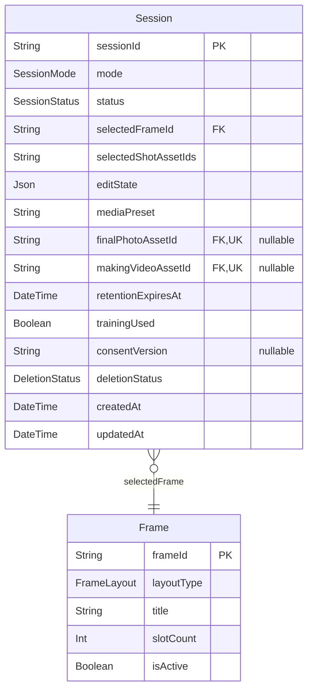
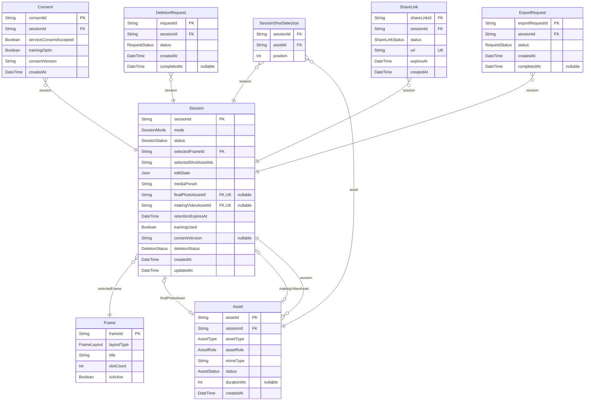
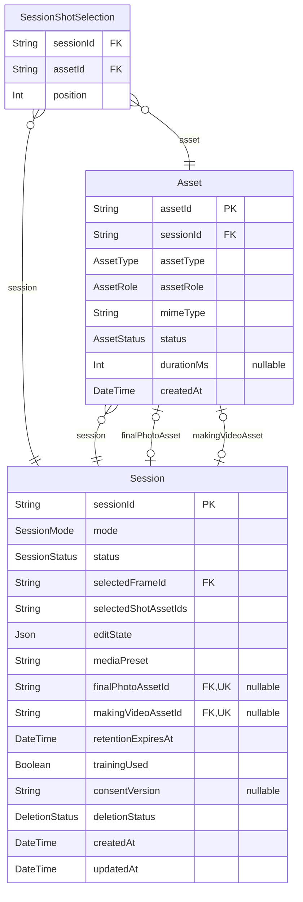
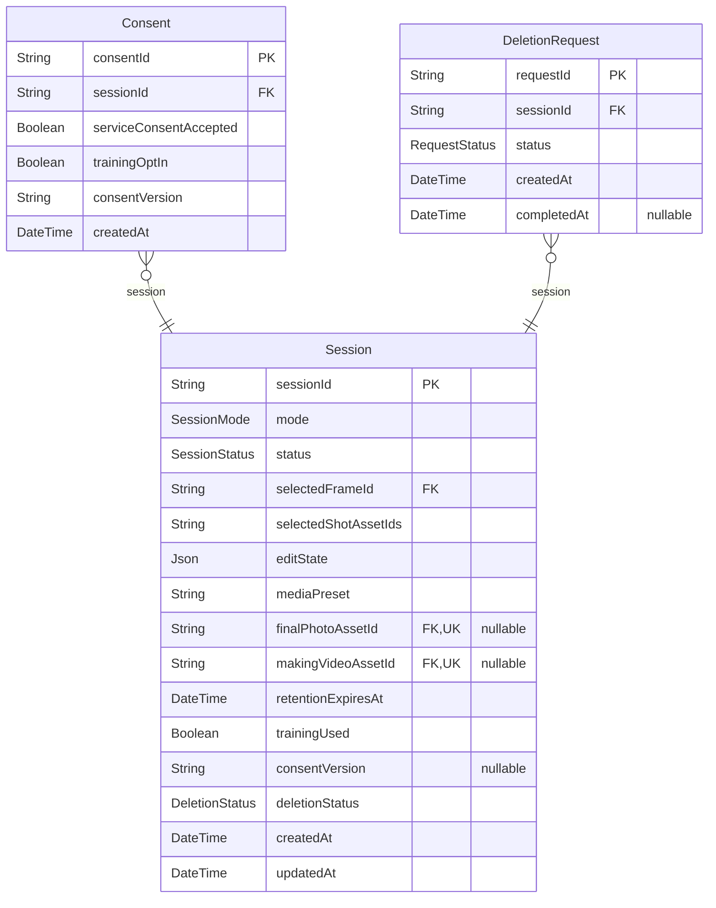
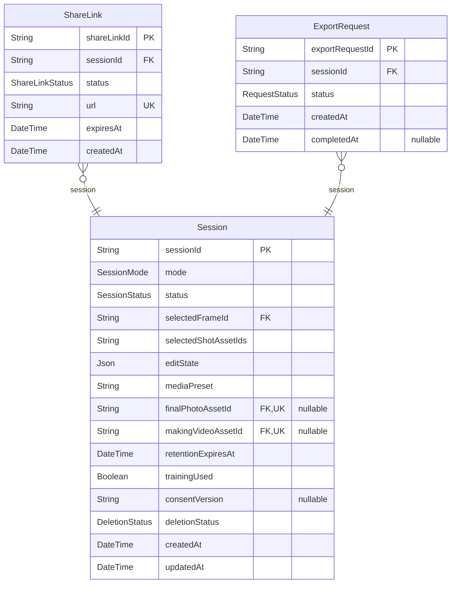

# Phos Data Model

> Generated by [`prisma-markdown`](https://github.com/samchon/prisma-markdown)

- [FrameCatalog](#framecatalog)
- [SessionFlow](#sessionflow)
- [MediaAssets](#mediaassets)
- [PrivacyControls](#privacycontrols)
- [DeliveryLifecycle](#deliverylifecycle)

## FrameCatalog

### `Frame`

Frame catalog item available to sessions.

Properties as follows:

- `frameId`: Stable frame identifier.
- `layoutType`: Layout variant exposed to clients.
- `title`: Human-friendly frame title.
- `slotCount`: Number of capture slots available in the frame.
- `isActive`: Whether the frame is currently selectable.

## SessionFlow

### `Session`

Core anonymous session aggregate.

Properties as follows:

- `sessionId`: Anonymous session identifier.
- `mode`: Session mode for capture experience.
- `status`: Session lifecycle status.
- `selectedFrameId`: Selected frame identifier.
- `selectedShotAssetIds`
  > Legacy compatibility snapshot for the current API implementation.
  > The ordered relational model should remain the source of truth.
- `editState`: Flexible edit payload for lightweight editing.
- `mediaPreset`: Media preset applied for device-tier optimization.
- `finalPhotoAssetId`: Rendered final photo asset.
- `makingVideoAssetId`: Recorded making video asset.
- `retentionExpiresAt`: Retention deadline for privacy cleanup.
- `trainingUsed`: Whether training data from this session has been used.
- `consentVersion`: Latest active consent version snapshot.
- `deletionStatus`: Privacy/deletion workflow state.
- `createdAt`: Session creation timestamp.
- `updatedAt`: Last mutation timestamp.

## MediaAssets

### `Asset`

Media generated or uploaded within a session.

Properties as follows:

- `assetId`: Stable asset identifier.
- `sessionId`: Owning session identifier.
- `assetType`: Physical media kind.
- `assetRole`: Functional role within the session flow.
- `mimeType`: MIME type served to clients.
- `status`: Availability status.
- `durationMs`: Optional duration for video assets.
- `createdAt`: Creation timestamp.

### `SessionShotSelection`

Snapshot of the ordered raw shots selected for rendering.

Properties as follows:

- `sessionId`: Parent session identifier.
- `assetId`: Selected raw shot asset identifier.
- `position`: Zero-based render order.

## PrivacyControls

### `Consent`

Immutable consent snapshot for auditing privacy decisions.

Properties as follows:

- `consentId`: Consent snapshot identifier.
- `sessionId`: Parent session identifier.
- `serviceConsentAccepted`: Required service terms acceptance.
- `trainingOptIn`: Optional model-training opt-in.
- `consentVersion`: Consent version shown to the user.
- `createdAt`: Snapshot creation time.

### `DeletionRequest`

User-triggered request to delete the session and invalidate delivery artifacts.

Properties as follows:

- `requestId`: Deletion request identifier.
- `sessionId`: Parent session identifier.
- `status`: Deletion workflow status.
- `createdAt`: Request creation time.
- `completedAt`: Completion timestamp.

## DeliveryLifecycle

### `ShareLink`

Downloadable share link for rendered session outputs.

Properties as follows:

- `shareLinkId`: Share link identifier.
- `sessionId`: Parent session identifier.
- `status`: Link availability status.
- `url`: Public URL served to end users.
- `expiresAt`: Expiration timestamp constrained by session retention.
- `createdAt`: Link creation time.

### `ExportRequest`

Request to export the session before deletion.

Properties as follows:

- `exportRequestId`: Export request identifier.
- `sessionId`: Parent session identifier.
- `status`: Export workflow status.
- `createdAt`: Request creation time.
- `completedAt`: Completion timestamp.
