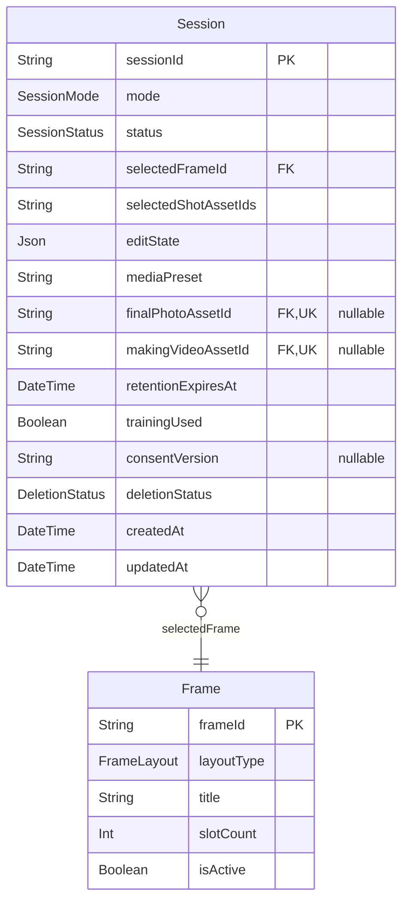
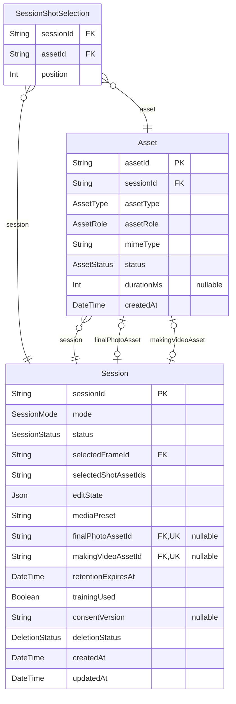
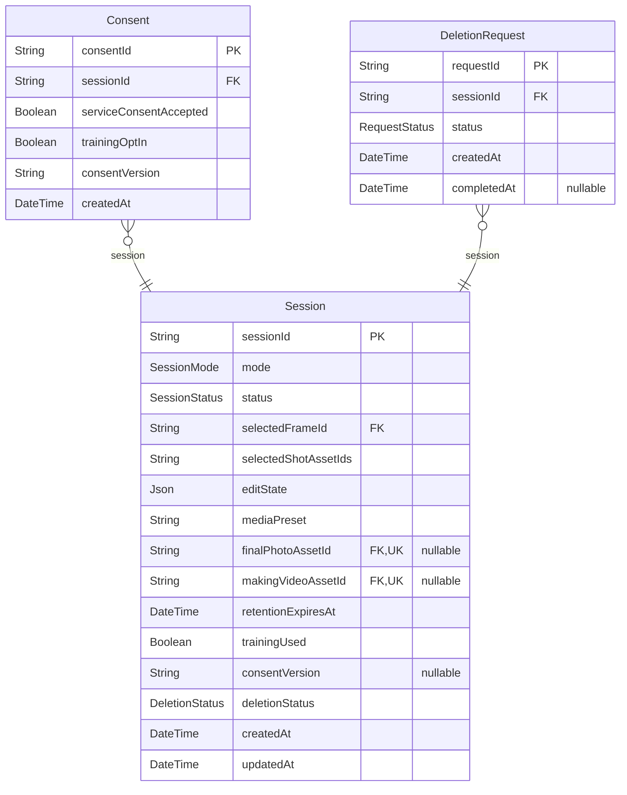
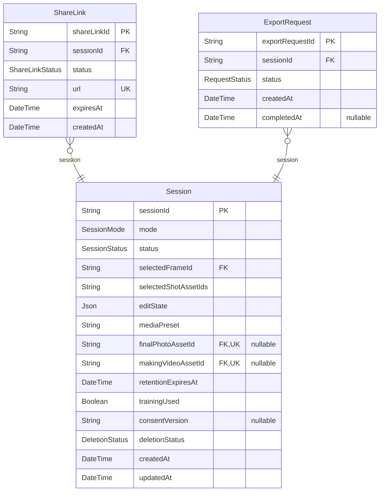

# Phos Data Model

> Generated by [`prisma-markdown`](https://github.com/samchon/prisma-markdown)

- [FrameCatalog](#framecatalog)
- [SessionFlow](#sessionflow)
- [MediaAssets](#mediaassets)
- [PrivacyControls](#privacycontrols)
- [DeliveryLifecycle](#deliverylifecycle)

## FrameCatalog

### `Frame`

세션에서 사용할 수 있는 프레임 카탈로그 항목.

Properties as follows:

- `frameId`: 변경되지 않는 프레임 식별자.
- `layoutType`: 클라이언트에 노출되는 레이아웃 변형.
- `title`: 사람이 읽기 쉬운 프레임 제목.
- `slotCount`: 프레임에서 사용할 수 있는 촬영 슬롯 수.
- `isActive`: 현재 선택 가능한 프레임인지 여부.

## SessionFlow

### `Session`

익명 세션의 핵심 집계 모델.

Properties as follows:

- `sessionId`: 익명 세션 식별자.
- `mode`: 촬영 경험에 사용되는 세션 모드.
- `status`: 세션 생명주기 상태.
- `selectedFrameId`: 선택한 프레임 식별자.
- `selectedShotAssetIds`
  > 현재 API 구현과의 하위 호환을 위한 스냅샷.
  > 순서가 있는 관계형 모델을 계속 최종 기준으로 삼아야 한다.
- `editState`: 가벼운 편집을 위한 유연한 편집 페이로드.
- `mediaPreset`: 디바이스 등급 최적화에 적용되는 미디어 프리셋.
- `finalPhotoAssetId`: 렌더링된 최종 사진 에셋.
- `makingVideoAssetId`: 기록된 메이킹 영상 에셋.
- `retentionExpiresAt`: 프라이버시 정리를 위한 보관 만료 시각.
- `trainingUsed`: 이 세션의 학습 데이터가 사용되었는지 여부.
- `consentVersion`: 최신 활성 동의 버전 스냅샷.
- `deletionStatus`: 프라이버시/삭제 워크플로 상태.
- `createdAt`: 세션 생성 시각.
- `updatedAt`: 마지막 변경 시각.

## MediaAssets

### `Asset`

세션 내에서 생성되거나 업로드된 미디어.

Properties as follows:

- `assetId`: 변경되지 않는 에셋 식별자.
- `sessionId`: 소유 세션 식별자.
- `assetType`: 물리적 미디어 종류.
- `assetRole`: 세션 흐름 내 기능적 역할.
- `mimeType`: 클라이언트에 제공되는 MIME 타입.
- `status`: 사용 가능 상태.
- `durationMs`: 비디오 에셋의 선택적 재생 길이.
- `createdAt`: 생성 시각.

### `SessionShotSelection`

렌더링용으로 선택된 원본 컷 순서 스냅샷.

Properties as follows:

- `sessionId`: 상위 세션 식별자.
- `assetId`: 선택된 원본 컷 에셋 식별자.
- `position`: 0부터 시작하는 렌더 순서.

## PrivacyControls

### `Consent`

프라이버시 결정 감사를 위한 불변 동의 스냅샷.

Properties as follows:

- `consentId`: 동의 스냅샷 식별자.
- `sessionId`: 상위 세션 식별자.
- `serviceConsentAccepted`: 필수 서비스 약관 동의 여부.
- `trainingOptIn`: 선택적 모델 학습 동의 여부.
- `consentVersion`: 사용자에게 표시된 동의 버전.
- `createdAt`: 스냅샷 생성 시각.

### `DeletionRequest`

사용자가 세션 삭제와 전달 산출물 무효화를 요청한 기록.

Properties as follows:

- `requestId`: 삭제 요청 식별자.
- `sessionId`: 상위 세션 식별자.
- `status`: 삭제 워크플로 상태.
- `createdAt`: 요청 생성 시각.
- `completedAt`: 완료 시각.

## DeliveryLifecycle

### `ShareLink`

렌더링된 세션 결과물을 내려받을 수 있는 공유 링크.

Properties as follows:

- `shareLinkId`: 공유 링크 식별자.
- `sessionId`: 상위 세션 식별자.
- `status`: 링크 사용 가능 상태.
- `url`: 최종 사용자에게 제공되는 공개 URL.
- `expiresAt`: 세션 보관 정책에 따라 제한되는 만료 시각.
- `createdAt`: 링크 생성 시각.

### `ExportRequest`

삭제 전에 세션을 내보내기 위한 요청.

Properties as follows:

- `exportRequestId`: 내보내기 요청 식별자.
- `sessionId`: 상위 세션 식별자.
- `status`: 내보내기 워크플로 상태.
- `createdAt`: 요청 생성 시각.
- `completedAt`: 완료 시각.
